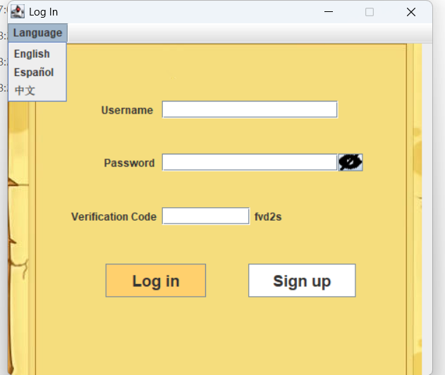
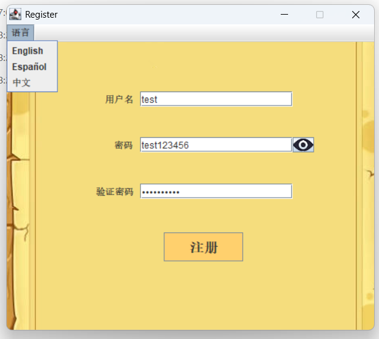
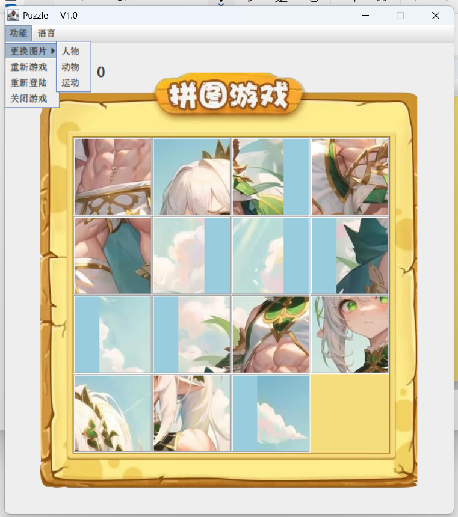

# HEIMA_Puzzle_YUZHANG

## 🧩 简介 Introduction | Introducción

这是一个基于黑马程序员视频教程、使用 Java 编写的拼图游戏，支持三种语言：中文、英语和西班牙语。  
This is a puzzle game developed in Java based on Heima's video tutorial, supporting three languages: Chinese, English, and Spanish.  
Este es un juego de rompecabezas desarrollado en Java basado en el tutorial en video de Heima, que ofrece tres idiomas: chino, inglés y español.

---

## 💻 功能 Features | Funcionalidades

- 三种语言切换：中文 / English / Español  
  Language switching: Chinese / English / Spanish  
  Cambio de idioma: chino / inglés / español

- 三个界面：登录、注册、游戏  
  Three interfaces: Login, Register, Game  
  Tres interfaces: Inicio de sesión, Registro, Juego

- 支持图像拼图逻辑与界面交互  
  Puzzle logic with image interaction  
  Lógica de rompecabezas con interacción gráfica

---

## 📸 截图 Screenshots | Capturas de pantalla

### 🖼 登录界面 Login Interface | Interfaz de Inicio de Sesión

### 🖼 注册界面 Register Interface | Interfaz de Registro

### 🧩 游戏界面 Game Interface | Interfaz del Juego

---

## 🎞️ 演示视频 Demo Video | Video de Demostración

<video src="Readme-Resource/simpledemo.mp4" controls width="600"></video>

---

## 🙌 欢迎贡献 Welcome to Contribute | Bienvenido a Contribuir

欢迎任何人对该项目进行优化与扩展！  
Anyone is welcome to optimize or extend the project.  
¡Cualquiera puede optimizar o extender el proyecto!
